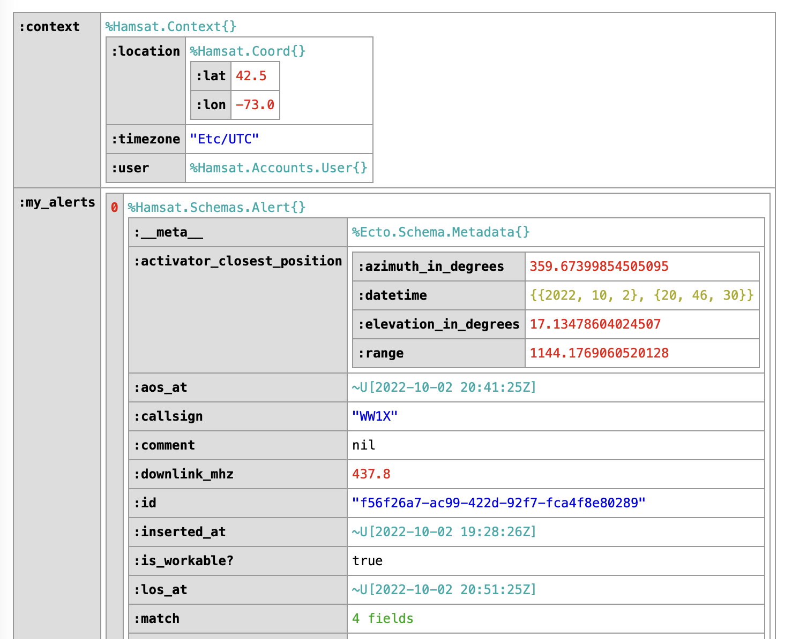

# LiveInspect

[](https://hex.pm/packages/live_inspect)
[](https://hexdocs.pm/live_inspect/)
[](https://github.com/schrockwell/live_inspect/blob/main/LICENSE)

Inspect LiveView assigns directly in the browser.

LiveView 0.17+ is currently supported.

## Examples

```heex
<.live_inspect term={assigns} />
<.live_inspect term={@my_assign} />
<.live_inspect term={%{my_assign: @my_assign, my_other_assign: @my_other_assign}} />
```

Maps and lists are collapsed by default, but can be clicked to expand and dig deeper.



## Installation

LiveInspect is a developer tool that should _never_ be used in a production environment, so be sure
to specify the `:only` option when adding it to your deps in `mix.exs`:

```elixir
def deps do
  [
    # IMPORTANT: Only in :dev environment!
    {:live_inspect, "~> 0.2", only: :dev}
  ]
end
```

Then, import `LiveInspect.live_inspect/1` into the generated Phoenix helpers:

```elixir
# lib/my_app_web.ex
defmodule MyAppWeb do
  def live_view do
    quote do
      # ...generated code...

      unquote(live_inspect())
    end
  end

  def live_component do
    quote do
      # ...generated code...

      unquote(live_inspect())
    end
  end

  defp live_inspect do
    if Mix.env() == :dev do
      quote do
        import LiveInspect, only: [live_inspect: 1]
      end
    end
  end
end
```
